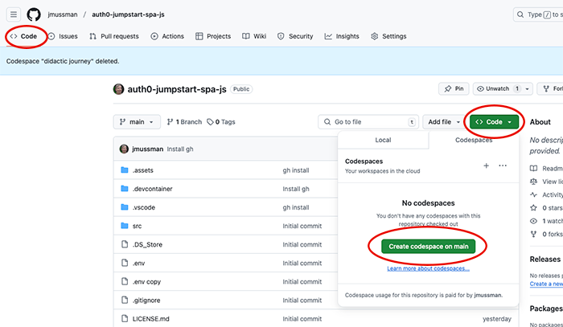
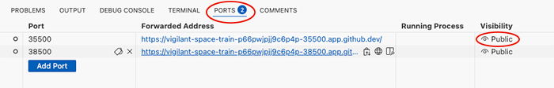
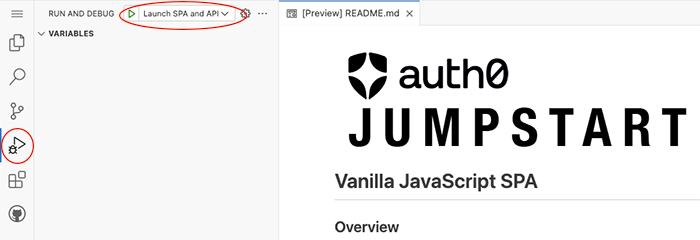
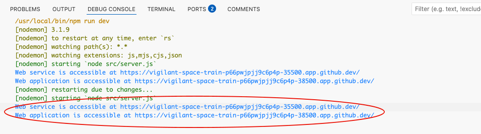
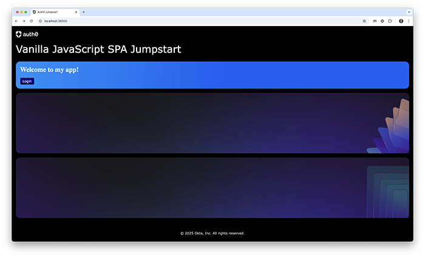
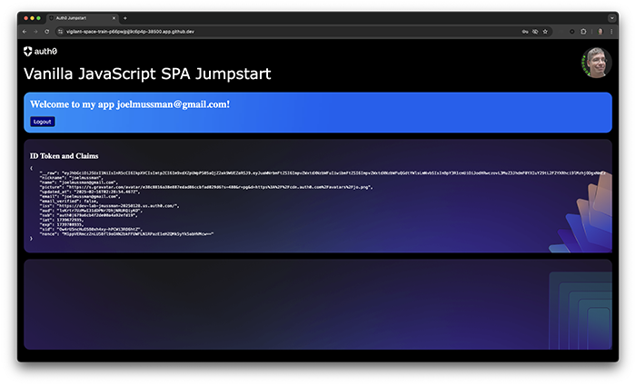
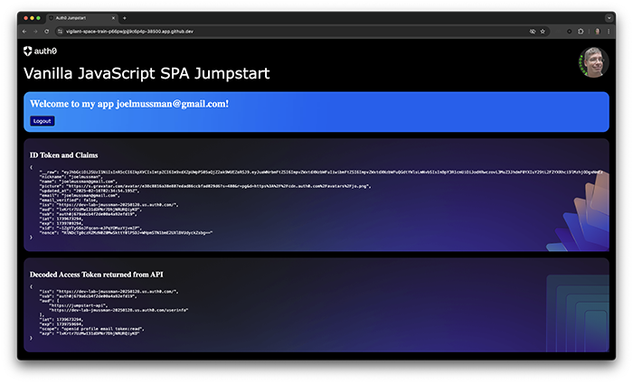

[//]: # (README.md)
[//]: # (Copyright © 2024 Joel A Mussman. All rights reserved.)
[//]: #


# Vanilla JavaScript SPA

## Overview

With all of the programming environments and frameworks out there sometimes it can be confusing
to follow what is going on, even when you know the platform.
This starter project parallels the Auth0 Quickstart integration for a vanilla JavaScript SPA at
[https://auth0.com/docs/quickstart/spa/vanillajs/interactive](https://auth0.com/docs/quickstart/spa/vanillajs/interactive).
The quickstart makes some assumptions about plugging the code into an existing
application.
This project is as simple and clean a vanilla SPA that we can build to accomplish that.
Because of the assumptions we are going to change a couple of things.

You can utilize this project three ways:

1. [Work on your local computer](#work-on-your-local-computer)
1. [Work in a Docker container hosted on your local computer](#work-in-a-docker-container-on-your-local-computer)
1. [Work in a GitHub Codespace](#work-in-a-github-codespace), a development environment hosted at GitHub

After you configure the environment, go to the [Instructions to Add Authentication](#instructions-to-add-authentication) and
set up your Auth0 tenant and add the authentication code to the application.

## Configuration

Familiarity with using Git and GitHub is expected.
If you want to save your work with a Git push then fork this repository into your own copy in your own GitHub account:

### Work on your local computer

#### Requirements

* NodeJS (tested with v22.14.0 LTS)
* Visual Studio Code
* Web Browser

#### Instructions

1. Clone this repo to your own computer, or better yet, fork it to your own GitHub
account and clone that repo.

1. Open the local repository folder in Visual Studio Code (or your IDE of choice).
1. Open a terminal window and install the NodeJS dependencies.
\$ stands in for the command prompt:
    ```
    $ npm install
    ```
1. Continue below with "[in all environments](#in-all-environments)".

### Work in a Docker Container on your local computer

Familiarity with using Docker on your local computer is expected.
Launching this project in Docker will pull new images into your environment, and
it will create new running containers.
You are responsible for managing those images and containers.
Look to the "Dev Containers" commands in the command VSCode command palette (ctrl/cmd-shift-P) to
launch a new container or reconnect to a running container.

#### Requirements

* Visual Studio Code
* Docker Desktop
* Web Browser

#### Instructions

1. Clone the repository to your own computer.

1. Open the local repository folder in Visual Studio Code.
1. If you catch it, VSCode will pop up a "toast" dialog and ask if you want to relaunch the project in
a container.
If you miss it, go to the command palette (ctrl/cmd-shift-P) and choose
"Dev Containers: Rebuild and Reopen in Container".
1. VSCode will reopen and connect to the Docker container.
When the environment is ready there will be a prompt "Done. Press any key to close the terminal."
Presee the enter/return key to proceed.
1. Continue below with "[in all environments](#in-all-environments)".

### Work in a GitHub Codespace

Remember, if you want to save your work fork a copy of the master repository in your own
GitHub account and use that.

#### Requirements

* Web Browser

#### Instructions

1. On the "Code" page of the repository, click the "Code" button, make sure you are on the
"Codespaces" tab, and then click the "Create codespace on main" button.

    

1. VSCode will open in your browser (it is a local copy connected to the container).
1. Wait for the prompt in the terminal "Finished configuring codespace. Press any key to exit."
Press the enter/return key to exit to the command prompt.
1. Click the "Ports" tab in the VScode lower panel and make sure the ports are public.
If they are not, right click on each one and change the visibility to "Public":

    

1. In the image above note the forwarded addresses.
These URLs will be how to reach the API and application from outside the codespace.
1. Continue below with "[in all environments](#in-all-environments)".

### In all environments

1. Open the Run-Debug panel by clicking on the icon in the toolbar.
        Then select the "Launch SPA and API" launch configuration from the dropdown list at the top.

    

1. Click the green *run arrow* to the left of the launch configuration dropdown list.
1. In the Debug tab of the bottom VSCode panel you will see the output from launching the application.
There will be two URLs displayed, the first is for the API and the second is for the application.
Technically they are displayed twice because the *Parcel* utility
sees a file change during launch and then relaunches the application.
Hold down the ctrl/cmd key and click on the URL (ctrl/cmd+click)
to open the application in your default browser:

    

1. If you are running in a GitHub codespace the URL will be flagged as a suspicious
    link to another user's codespace, but it is really your own.
    It is ok to proceed to the application.

1. The default landing page for the application looks like this:

    

1. Record the URL used to access the application, it will be required in the next part.

1. Continue with the "Instructions to Add Authentication" next:

## Instructions to Add Authentication

These instructions follow the instructions at
[https://auth0.com/docs/quickstart/spa/vanillajs/interactive](https://auth0.com/docs/quickstart/spa/vanillajs/interactive)
with a few changes that are best practices for application development.

### Establish an Auth0 tenant

1. Establish an Auth0 tenant:
    1. If you have a tenant you can add an API and application to that will work.

    1. If you have an Auth0 adminstrator account (a login in at https://auth0.com) *and you can create a new tenant*,
        that will work too.
    1. Failing 1 & 2, click the "Sign Up" button at https://auth0.com and create a new administrator account.
        You will need to enroll multi-factor authentication (MFA) to access the account.
        Do *NOT* use a social identity to log in and create this account, that will lock up that email address permanently.
        If you want to use your social email address add a +identifier to make the account unique, like joelmussman+250216@gmail.com.
        Your social provider will ignore everything after the + and still send email to your regular account, but it looks
        like a different email to Auth0.
        Creating the account establishes a brand-new developer tenant, you can use that tenant to proceed.
1. On the left-menu of the tenant dashboard select *Branding &rarr; Universal Login*.

1. Click the exapanding area labeled *Customization Options*.
1. Under the *Styles* section at the left select the option for *Widget*.
1. Under the *Widget* selection on the right set the logo URL to:
    ```
    https://raw.githubusercontent.com/jmussman/cdn-fun/main/images/auth0-logo.png
    ```
1. Under the *Styles* section select *Page Background*.
1. Under the *Page Background* section on the right set the *Background image url* to:
    ```
    https://raw.githubusercontent.com/jmussman/cdn-fun/main/images/auth0-jumpstart-background.jpg
    ```
1. Above this field look for *Page Layout* and click the icon to place the login at the right of the page.
1. In the left-menu of the tenant dashboard select *Applications &rarr; APIs*.
1. Click the *+ Create API* button.
1. Set the *Name* to *Jumpstart API*, the *Identifier* to *https://jumpstart-api*, and click the *Create* button.
1. At the top of the API page select the *Permissions* tab.
1. Under *Add a Permission* set the *Permission* to *token:read*, the *Descrioption* to *Read token claims*, and click the *+ Add* button.
1. In the left-menu of the tenant dashboard select *Applications &rarr; Applications*.
1. Click the *Create Application* button.
1. Leave the name as "My App", select the *Single Page Web Applications* type, and click the *Create* button.
1. On the application pages click on the *Settings* tab.
1. Scroll down to the *Application URIs* section.
1. Paste the application URL (which you saved in the first part) into the *Allowed Callback URLs*, *Allowed Logout URLs*,
    and *Allowed Web Origins* fields.
    If you cannot find the URL, open the *Ports* tab in the bottom VSCode panel and copy the URL for given for port 38500.
1. Click the *Save Changes* button at the lower right.

### Configure the application and the Auth0 application configuration

1. Back in VSCode click the *Explorer* button 

1. In the folders tree expand the folder *src/assets/script*.
1. Double-click *main.js* to open and edit the file.
1. Locate the *window.addEventListener('load', async () => {* function call at the end of the file (it is the last piece of code).
1. After this line paste in the code from the quickstart.
    Here is a copy:
    ```
    auth0.createAuth0Client({
        domain: "auth0-domain",
        clientId: "client-id",
        authorizationParams: {
            redirect_uri: window.location.origin
        }
        }).then(async (auth0Client) => {
        // Assumes a button with id "login" in the DOM
        const loginButton = document.getElementById("login");

        loginButton.addEventListener("click", (e) => {
            e.preventDefault();
            auth0Client.loginWithRedirect();
        });

        if (location.search.includes("state=") && 
            (location.search.includes("code=") || 
            location.search.includes("error="))) {
            await auth0Client.handleRedirectCallback();
            window.history.replaceState({}, document.title, "/");
        }

        // Assumes a button with id "logout" in the DOM
        const logoutButton = document.getElementById("logout");

        logoutButton.addEventListener("click", (e) => {
            e.preventDefault();
            auth0Client.logout();
        });

        const isAuthenticated = await auth0Client.isAuthenticated();
        const userProfile = await auth0Client.getUser();

        // Assumes an element with id "profile" in the DOM
        const profileElement = document.getElementById("profile");

        if (isAuthenticated) {
            profileElement.style.display = "block";
            profileElement.innerHTML = `
                    <p>${userProfile.name}</p>
                    
                `;
        } else {
            profileElement.style.display = "none";
        }
    });
    ```
1. In the code locate the line that reads: *// Assumes an element with id "profile" in the DOM*.
1. Replace that from that line to the end of the function with
    ```
    toggleIsAuthenticated(isAuthenticated, userProfile, claims);
    ```
1. The quickstart assumes specific HTML elements in the application that will be turned on after
    authentication. This replaces that with a call to a function that will manage the local HTML,
    revealing and hiding elements as the user authenticates and then logs out.
1. Just above this line, and directly below the line *const userProfile = await auth0Client.getUser();* add a line
    to retrieve the ID token "claims", the user information the tenant provides to the application:
    ```
    const claims = await auth0Client.getIdTokenClaims();
    ```
1. The other best-practice not followed in this code is externalizing the domain and client id.
    Change the value of the *domain* property at the top of the function to read *process.env.AUTH0_DOMAIN*.
1. Change the value of the *clientID* property to read *process.env.AUTH0_CLIENT_ID*.
1. Edit the *.env* file in the project folder (the top of the tree).
    ```
    AUTH0_DOMAIN=
    AUTH0_CLIENT_ID=
    APP_SERVICE_PORT=38500
    API_SERVICE_PORT=35500
    API_AUDIENCE=https://profile
    API_URL=
    ```
1. Go back to the tenant and in the application settings (you should still be there), copy the
    *Domain* and make it the value of the *AUTH0_DOMAIN* variable in .env.
1. From the tenant copy the *Client ID* and paste it as the value of *AUTH0_CLIENT_ID* variable.
1. Externalizing the values is important, because at different points in the devops cycle (development, continuous integration, deployment)
    different Auth0 tenants will be utilized and this prevents changing the application code.
1. Save the open files.
    The *Parcel* utility should reload the web page automatically; if you had stopped the application it restart it now and open the page in the browser.
1. In the application click the *Login* button.
1. Register a new user by clicking the sign up link and providing an email address and password.
    *Important: it does NOT need to be a real email address, you can make anything up!*
1. If you are developing on your local computer you will need to consent to the information for this user to be shared with *My App*.
    This is because Auth0 assumes any application running at http://localhost could potentially be malware and wants to
    protect regular users.
    Developers know their application is running at this address, so the consent request is expected.
1. Investigate the *claims* provided to the application in the ID token.
    If the login has an avatar at https://gravatar.org it will show up on the header bar.

    

1. If you desire, you may logout and test the application using a Google account to show that Auth0 proxies (and normalizes) the
    identity information received from Google.
1. Click the logout button.
1. Stop the application.
    Find the floating toolbar for run-debug and click red square:

    

### Leverage the access token for API authorization

1. Access tokens move user authorization from the API to the identity provider, where multiple applications may be managed in one place.

1. In the tenant dashboard menu click *User Management &rarr; Users*.
1. Find the user that you logged in with, and click the name to go to the settings.
1. Click the *Permssions* tab.
1. Click the *Assign Permission* button.
1. In the dialog with the API dropdown list select the *Jumpstart API*.
1. In the *Permissions* list pick the *token:read* permission, then click the *Add Permission* button.
1. Back in the code find the *authorizationParams* property under the *CreateAuth0Client* function call.
1. In authorizationParams add a new property *Audience* property, this tells the tenant which API to provide an access token for:
    ```
        authorizationParams: {
            audience: process.env.API_AUDIENCE
    ```
1. Immediately below that add a new *scope* property to request "grants" that give the application resources or permissions:
    ```
            scope: "openid profile email offline_access token:read"
    ```
1. The default *scope* which was used to start with requests "openid profile email", which requests an ID token, the basic user profile information, and the user email address.
    We added "offline_access" to include refresh tokens, and "token:read" so the API will provide the deciphered token claims.
1. Find the line near the end of the code: *const claims = await auth0Client.getIdTokenClaims();*.
1. After that line add a new line to make the API request and get the message:
    ```
    const apiMessage = isAuthenticated ? await retrieveJumpstartAPIMessage(auth0Client) : null;
    ```
1. Below that find the line we added earlier: *toggleIsAuthenticated(isAuthenticated, userProfile, claims);*.
1. Add the message as a fourth argument:
    ```
    toggleIsAuthenticated(isAuthenticated, userProfile, claims, apiMessage);
    ```
1. Use the run-debug panel to launch the application again.
    Visit the page and sign on as the user.
    Now the access token is used to authorize a request to the API.
    If the user has the *token:read* permission, the API returns a decoded version of the token for display:

    

1. Logout and stop the application.

### Clean up the code (optional)

The remaining problem is the code from the quickstart that we added still uses a promise,
while the rest of the application is using the newer JavaScript form of async/await
(it is just another syntax for a promise).
We can clean that up:

1. In the event listener locate the call to *createAuth0Client({...}).then(...*.
1. Change the call to await a return of the client object instead of the promise:

    ```
    auth0Client = await createAuth0Client({
    ```
1. Replace the *.then(async (auth0Client) => {* line that opens the action for the promise
    with a semicolon.
1. Remove the }); that closed the *then* at the end of the function.
1. Shift the remaining lines that were enclosed in the *then* left to balance the indentation.
1. Start the application and test it.
1. Logout and stop the application.

<br>

 Congratulations, you have completed this task!

## License

The code is licensed under the MIT license. You may use and modify all or part of it as you choose, as long as attribution to the source is provided per the license. See the details in the [license file](./LICENSE.md) or at the [Open Source Initiative](https://opensource.org/licenses/MIT).


<hr>
Copyright © 2025 Okta, Inc. All rights reserved.